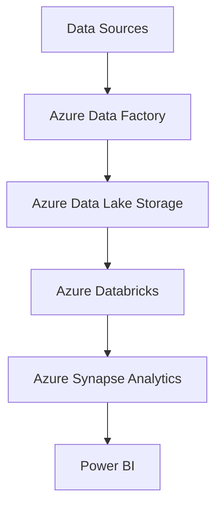

# TransLogix Analytics Azure Data Engineering Solution

## Overview

TransLogix Analytics is a data engineering solution designed to leverage Azure services for scalable, secure, and efficient analytics. This project enables data ingestion, transformation, storage, and visualization for logistics and transportation data.

## Features

- **Azure Data Factory** for orchestrating data pipelines
- **Azure Data Lake Storage** for scalable data storage
- **Azure Databricks** for data transformation and analytics
- **Azure Synapse Analytics** for data warehousing
- **Power BI** integration for interactive dashboards

## Architecture

## 📁 Folder Structure

logistics-analytics-platform/
│
├── data/ # Dummy CSVs (drivers, vendors, routes, shipments)
├── notebooks/ # Databricks Notebooks for each layer
├── adf_pipelines/ # ADF JSON definitions
├── powerbi/ # Power BI screenshots or .pbix files
├── architecture/ # Architecture diagram image
├── README.md # This file
└── .gitignore

## 📊 Power BI Dashboard Features

- ✅ KPI Cards: Total Shipments, Avg Delay, On-Time %
- 📊 Vendor performance bar charts
- 📈 Monthly delivery trend lines
- 🗺️ Route-level delay matrix (simulated map)
- 🎯 Filters: Vendor, Route Type, Origin, Destination

---

## 📌 Pipeline Stages

### 🔹 Bronze Layer (Raw Ingestion)
- Raw files: `drivers.csv`, `vendors.csv`, `routes.csv`, `shipments.csv`
- Ingested using **ADF Copy Activity** with **ForEach loop**
- Stored in Azure Data Lake under the `bronze/` container

### 🔸 Silver Layer (Cleansed)
- Field renaming and schema standardization
- Converted timestamps and metrics (e.g., delay in minutes)
- Stored as partitioned Parquet files in `silver/` container

### 🟡 Gold Layer (Aggregated)
- Enriched metrics like:
  - On-Time %
  - Delay by route
  - Vendor KPIs
  - Monthly trends
- Written to `gold/` container, ready for Power BI

---

## 📤 How to Reproduce

1. Clone this repo
2. Upload `/data/` CSVs to Azure Data Lake Gen2 (`raw` container)
3. Import and run ADF pipelines from `/adf_pipelines/`
4. Execute transformation notebooks in `/notebooks/` inside Databricks
5. Open Power BI file from `/powerbi/` and connect to `gold` container

## Prerequisites

- Azure Subscription
- Access to Azure Portal
- Power BI account

## Contributing

Contributions are welcome! Please see [CONTRIBUTING.md](CONTRIBUTING.md) for guidelines.
